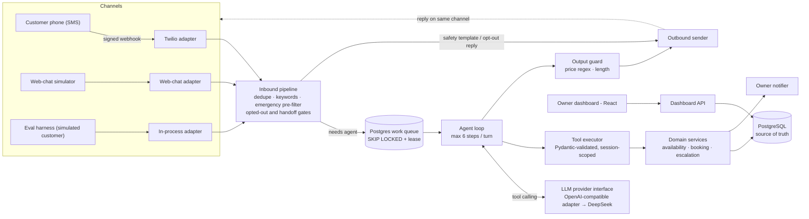
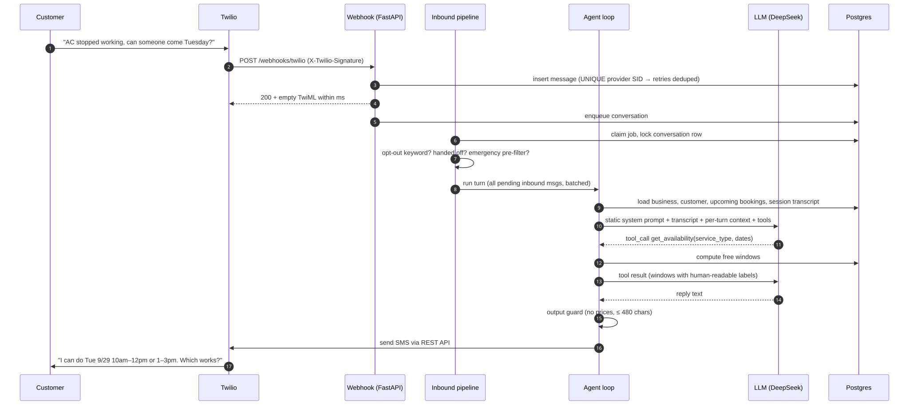
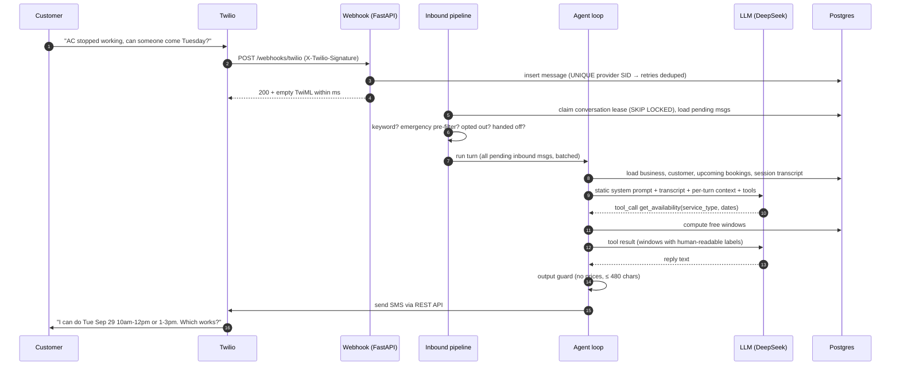
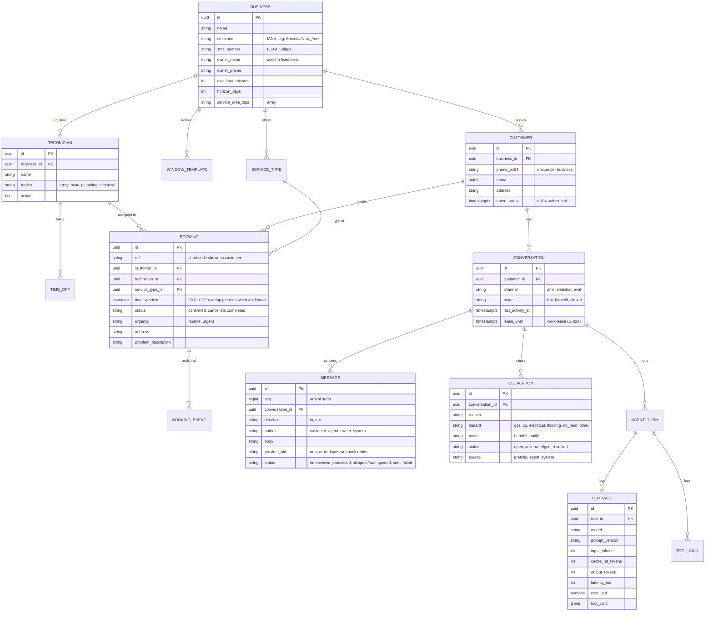

# SMS Booking Agent: Design (Phase 0)

Status: Phase 0 design, updated with Phase 1 findings (2026-09-29) · Decision IDs (D-xxx) refer to [`DECISIONS.md`](../DECISIONS.md)

## 1. Problem and goals

Small HVAC, plumbing, and electrical shops (1–10 technicians) lose jobs because nobody answers customer texts while everyone is on a job. The agent answers inbound SMS on the business's number and does the following:

1. Collects name, address, service type, problem description, urgency, and preferred time windows.
2. Books a real, conflict-free arrival window with a qualified technician.
3. Confirms the booking, and handles reschedules and cancellations.
4. Hands off to the owner when it should not act alone: emergencies, upset customers, price questions, out-of-scope requests, or uncertainty.

**Success criteria for this project.** The success criteria are measured, not asserted (Phase 3–4 eval harness):

| Metric | Target (initial, revisit after first eval run) |
|---|---|
| Double-bookings | **0**, guaranteed by the DB, not the model |
| Emergency handling (safety msg + escalation, no booking) | ≥ 98% on emergency scenarios; every miss is listed individually |
| Correct escalation rate | ≥ 90% |
| Task success (normal booking / reschedule / cancel) | ≥ 85% |
| Cost per conversation | < $0.01 on the default model |

**Non-goals** (from the spec): invoicing, payments, voice, a full CRM, multi-tenant billing, and a technician app. v1 serves **one business per deployment**. The schema carries `business_id` everywhere so multi-tenancy stays possible later, but none of it is built.

**Fixed inputs from the owner (2026-09-26):**

- LLM: the DeepSeek V4 family only.
- Budget: **under $10/month**, all-in.
- Cloud: decided at Phase 6.
- Pilot: a portfolio project with friendly testers, no real business.
- Seed business: fictional ("Brightwater Home Services"), time zone `America/New_York`.

## 2. Architecture





**The core idea is layers of decreasing determinism.** Everything that must *never* go wrong is handled by plain code before or after the LLM: opt-out, emergencies, double-booking, price leakage, and data access scope. The LLM does only what needs language understanding: extracting details from messy texts, asking good follow-up questions, and choosing which tool to call. If the model misbehaves, the worst outcome is a bad SMS reply or an unnecessary escalation, never a double-booking or a missed safety message on a keyword-detectable emergency (D-001, D-002).

**One code path for all channels.** Twilio, the web-chat simulator, and the eval harness all call the same `handle_inbound(channel, business, from_number, body)` function. Only the transport differs, so the evals measure the production path (D-013).

## 3. Main flow: one customer turn





The webhook acknowledges Twilio immediately and the agent runs asynchronously. One turn can take several LLM calls, which risks Twilio's webhook timeout. A process crash mid-turn cannot lose a message: the message row stays `received` until processed, and the queue re-claims it (D-012).

**Pipeline order.** Each step can end the turn without an LLM call. The order changed in Phase 1: the emergency pre-filter now runs *before* the opted-out and handoff gates (D-025, D-028).

1. **Dedupe.** A duplicate provider SID is ignored (unique index, so it holds under concurrent retries).
2. **Keywords.** `STOP`, `STOPALL`, `UNSUBSCRIBE`, `CANCEL`, `END`, `QUIT`, `OPTOUT`, and `REVOKE` as the whole message (case and surrounding punctuation ignored), plus natural phrasings like "stop texting me", mark the customer opted out and send one confirmation. `START`, `UNSTOP`, and `YES` re-subscribe, but only an opted-out customer: a subscribed customer's "Yes" is a booking confirmation and goes to the agent. `HELP` and `INFO` return fixed text (D-020, D-028).
3. **Emergency pre-filter.** A keyword/regex match escalates as `emergency` with handoff, sends the fixed safety template for that hazard, and ends the turn. It runs even when a human already owns the conversation, and even for opted-out customers, who get no text but whose owner is paged. Tuned for recall (D-003, D-004).
4. **Opted-out gate.** Other messages from an opted-out customer are marked `skipped`. No reply goes out, and the owner is alerted so the lead isn't lost.
5. **Handoff gate.** If a human owns the conversation, the message is stored and the owner is notified, with no bot reply.
6. **Agent loop.** Runs only if steps 1–5 did not end the turn. If it raises, the customer gets the fixed fallback text and the conversation escalates as `system_error`.

A batch can mix these: "HELP" followed by "my AC is broken" gets the help text and an agent turn for the second message.

**Claiming work** (D-024). A worker claims a conversation by writing a lease (token plus expiry) in a short transaction, processes it with no transaction held open across LLM calls, and releases the lease. Texts that arrive mid-turn get a follow-up turn before the release (up to three), so a customer who keeps typing is never left waiting on the poller. A crashed worker's lease simply expires. Each tool call commits on its own, so a booking that succeeded stays booked even if a later step of the turn fails.

## 4. Agent design

**Tool set.** Five tools, fixed. Arguments are Pydantic models, and the JSON Schema sent to the LLM is generated from them (D-001):

| Tool | Arguments (LLM-supplied) | Server-side behavior |
|---|---|---|
| `get_availability` | `service_type`, `earliest_date`, `latest_date`, optional `part_of_day` | Returns ≤ 6 free windows, each with a slot id and a label like "Tue Sep 29, 10am-12pm" (ASCII hyphen, D-027) |
| `create_booking` | `service_type`, `slot_start`, `customer_name`, `address`, `zip`, `problem_description`, `urgency` | Re-checks availability, assigns a technician, and inserts inside a transaction. Idempotent. |
| `reschedule_booking` | `booking_ref`, `new_slot_start` | Moves the booking in place and writes an audit event |
| `cancel_booking` | `booking_ref`, optional `reason` | Idempotent. Cancelling an already-cancelled booking returns `already_cancelled`. |
| `escalate_to_owner` | `reason` (enum), `summary`, optional `hazard` | The **server** applies the escalation policy: handoff or notify (see below) |

**Session scoping.** Tool arguments never include `customer_id`, `business_id`, or a phone number. Identity comes from the conversation session on the server. A prompt-injected "cancel all bookings for 555-0199" has no way to name another customer, because `booking_ref` lookups are filtered by the session's customer (D-010).

**Errors are data.** Invalid arguments and domain failures (`slot_unavailable`, `outside_service_area`, `booking_not_found`) return a structured tool result the model can recover from. For example, `slot_unavailable` includes alternative windows. They do not raise exceptions.

**Loop limits.** At most **6 LLM calls per turn**, a 45-second wall-clock budget, a 20-second timeout per call, and one retry with backoff. When any limit is hit, the customer gets a fixed fallback message ("Thanks, we got your message and someone will follow up shortly"), and the conversation escalates with reason `system_error`. The customer is never left without a reply.

**Escalation policy.** A server-side table decides the mode. The LLM only classifies the reason (D-011):

| Reason | Mode | Bot keeps talking? |
|---|---|---|
| `emergency` | handoff, plus fixed safety template for the hazard | No |
| `upset_customer`, `human_requested`, `uncertain`, `out_of_scope` | handoff, plus fixed handoff message | No |
| `price_quote` | notify: the owner gets pinged, and the agent says pricing comes from the owner | Yes, it can still book |
| `urgent_no_availability` | notify, and the earliest window is offered | Yes |
| `system_error` (server-raised) | handoff | No |

Off-topic chit-chat ("what's the weather?") gets a one-line redirect and **no** escalation. Escalating everything would drown the owner.

**Conversation state.** Nothing lives in model memory (D-005). Each turn, the context is rebuilt from the DB:

- The static system prompt, which is versioned.
- The business profile: services, hours, and service area.
- The customer profile and their **upcoming confirmed bookings, read fresh from the DB**.
- The session transcript, including earlier tool calls and results.
- A per-turn context note. The note holds the current local date/time and a 14-day calendar ("Tue = 2026-09-29"), so the model looks dates up instead of computing them.

A session ends after 24 hours of inactivity, which keeps the context short and stops stale offers from carrying over (D-021). A conversation in handoff mode never times out: it stays with the owner until they resolve the escalation (D-025).

**Prompt layout for caching.** The static system prompt and business profile come first. Every turn only **appends** (context note → customer text → tool calls → reply), so earlier messages are never rewritten. DeepSeek caches prompt prefixes automatically, and cache-hit input costs about 2–3% of the cache-miss price. An append-only layout keeps most input tokens on the cheap path. Every LLM call logs `prompt_version` (a name plus a content hash) (D-015).

**Output guard.** Deterministic checks run before any send:

- A currency/price regex (`$` + digits, "N dollars/bucks").
- A length cap of 480 characters (3 SMS segments).
- GSM-7 only (D-027). Every fixed template and time label is tested for it. Phase 2 adds the same check (with normalisation of curly quotes and dashes) to the model's output.

On a violation, the model regenerates once with feedback. If it fails again, the customer gets a fixed fallback and the conversation escalates. More guards (for example, time-promise checks) are added only when evals show a real failure mode (D-016).

## 5. Safety design (emergencies)

This design uses **two detectors and one fixed response**:

- **Pre-filter.** Deterministic, runs before the LLM, and catches keyword-visible hazards:
  - Gas smell/leak and "rotten egg" smell.
  - A carbon monoxide alarm or detector going off.
  - Burning smell, smoke, sparks, or melting near electrical equipment.
  - Flooding or a burst pipe.
  - No heat combined with freezing temperatures or at-risk pipes.
- **LLM.** For hazards that are stated indirectly ("the outlet by the crib is hot and smells like plastic"), the model calls `escalate_to_owner(reason="emergency", hazard=...)`.
- **One fixed response.** Whichever detector fires, the server sends the **fixed template** for that hazard and hands off to the owner. The LLM never writes safety text and never books during an emergency.

**Recall over precision.** A false alarm costs one extra safety text and an owner ping. A miss can cost a life. Templates are worded conditionally ("If you smell gas, leave the building now…") so a false positive reads as reasonable advice, not a misfire (D-004). The eval set includes **emergency look-alikes** to measure false positives, such as "install a gas water heater" or "smelled burning last month, electrician fixed it".

Draft templates (the business owner should review these before any real use):

| Hazard | Template (draft) |
|---|---|
| Gas | If you smell gas, leave the building now. Don't flip switches, use phones inside, or light anything. Once outside, call 911 or your gas utility's emergency line. I'm alerting {owner} right now. |
| Carbon monoxide | If your carbon monoxide alarm is going off, get everyone, pets included, outside to fresh air now and call 911. Don't go back in until responders say it's safe. I'm alerting {owner} right now. |
| Electrical | If you see sparks or smoke or smell burning, stay away from it. If you can safely reach your breaker panel, switch off that circuit. If there's any fire or smoke, get out and call 911. I'm alerting {owner} right now. |
| Flooding | If water is flooding, shut off your main water valve if you can do it safely, and keep away from outlets or electrical equipment near the water. I'm alerting {owner} right now. |
| No heat, freezing | If anyone is at risk from the cold, please go somewhere warm. Don't use an oven or grill to heat your home. I'm alerting {owner} right now. |

## 6. Scheduling and time zones

**Model: arrival windows** (D-007). The business defines weekly window templates in local wall time, for example weekdays 8–10, 10–12, 1–3, 3–5 and Saturday 9–11, 11–1. Each job occupies **one window on one technician**. The customer books a window, not a technician. The server assigns the least-loaded qualified technician that day, with ties broken by technician id so tests are deterministic. The agent only ever promises the window ("arrives between 10am and 12pm"), which follows the spec's rule against unverifiable arrival times.

**Availability.** A window is available when all of the following hold:

- It starts at least `min_lead` (default 2 h) from now.
- Its local date falls within `horizon` (default 14 days, counting today as day 1).
- At least one active technician with the right trade has no time off overlapping it.
- That technician has no confirmed booking overlapping it.

The service must be `bookable`. Multi-visit jobs and jobs that need an estimate first (installs, panel upgrades) are not, and the agent routes them to the owner as a quote. The customer's ZIP must be in the business's service area.

**Time zones** (D-009):

- All timestamps are `timestamptz` and stored in UTC.
- The business holds an IANA zone.
- Window templates are local wall times, converted to UTC **per date** with `zoneinfo`. That way, 8am on Nov 2 (EST, UTC-5) and 8am on Oct 30 (EDT, UTC-4) both come out right.
- Customer-facing times are always shown in the business's zone.
- Phase 1 tests cover the 2026-11-01 fall-back and 2027-03-14 spring-forward transitions.

**No slot holds in v1** (D-008). Between "here are your options" and "yes, Tuesday", another customer could take the slot. `create_booking` re-checks inside its transaction and returns `slot_unavailable` with alternatives, which the agent re-offers. At 1–10 technicians and low concurrency, this is rare and cheap to recover from. Holds would add TTL cleanup and a new failure mode.

## 7. Data model





Tables not expanded above are `service_types` (code, label, trade, bookable), `window_templates` (weekday, start_local, end_local), `technician_time_off` (tstzrange), `booking_events` (created/rescheduled/cancelled with old and new window and actor), `agent_turns` (trigger messages, steps, outcome, prompt version), and `tool_calls` (name, args, result, status, latency). The Phase 1 migration creates everything except `agent_turns`, `llm_calls`, and `tool_calls`, which arrive with the agent loop in Phase 2.

**Integrity rules enforced by Postgres, not app code** (D-006):

- `bookings`: `EXCLUDE USING gist (technician_id WITH =, time_window WITH &&) WHERE (status = 'confirmed')` (needs `btree_gist`). Two confirmed bookings can never overlap on one technician, regardless of races, retries, or model behavior.
- `bookings`: partial unique index on `(customer_id, service_type_id, lower(time_window)) WHERE status = 'confirmed'`. A repeated `create_booking` for the same customer, service, and window returns the existing booking instead of creating a second one. This is idempotency by natural key.
- `messages.provider_sid` is UNIQUE, so Twilio webhook retries are no-ops.
- `customers (business_id, phone_e164)` is UNIQUE.
- `conversations`: partial unique index on `(customer_id, channel) WHERE mode <> 'closed'`, so two simultaneous first texts from a new number open one conversation.

Concurrent races: when two customers book the last window, one insert hits the exclusion constraint. The service catches it and tries the next qualified technician. If none is free, it returns `slot_unavailable` with alternatives. READ COMMITTED is enough because the constraint does the serialization.

The Phase 1 race tests (a barrier makes every transaction find the window free before any of them writes) found one thing the design missed: several transactions inserting mutually conflicting rows can **deadlock** under an exclusion constraint, and Postgres only breaks each cycle after `deadlock_timeout` (1 s). With eight writers on one technician this became 20 to 35 seconds of back-to-back deadlocks. Writers now take a `FOR NO KEY UPDATE` lock on the technician row inside the write's savepoint, so they queue instead of deadlocking. The lock is for liveness only; the constraint remains the guarantee, and a deadlock that still happens is caught and retried (D-026).

## 8. LLM provider and cost

**Provider interface** (D-014). A single `complete()` interface takes system, messages, tools, and model, and returns an `LLMResult` with message, tool calls, usage, latency, and cost. It has two implementations:

- `OpenAICompatibleProvider`. DeepSeek exposes an OpenAI-compatible API, so the same adapter also works with OpenAI, OpenRouter, US hosts of DeepSeek's open weights, or a local vLLM server. Switching is a config change.
- `FakeProvider`. It replays scripted responses, so the agent loop's control flow is unit-tested with zero API cost and full determinism.

**Models.** The default agent is `deepseek-flash` (DeepSeek-V4.1-Flash) in non-thinking mode, and `deepseek-v4-pro` serves as a comparison model. The eval harness decides whether Flash's tool calling is good enough. "Thinking on vs. off" is one of the planned experiments.

**Price basis** (DeepSeek pricing page, fetched 2026-09-26, per 1M tokens):

| Model | Cache hit | Cache miss | Output |
|---|---|---|---|
| deepseek-flash | $0.003 | $0.15 | $0.60 |
| deepseek-v4-pro | $0.022 | $0.66 | $1.98 |

These are off-peak prices; peak is double. Peak hours are 01:00–04:00 and 06:00–10:00 UTC on weekdays, which is late evening and pre-dawn US Eastern, so US daytime runs are off-peak. The cost calculator stores these as config and must be re-checked before relying on it.

**Estimated eval cost.** Assumptions: ~7 customer turns, ~13 agent LLM calls of ~4k input tokens each at a 75% cache-hit rate, ~2k output tokens, a Flash-simulated customer, and one judge call. Script: `scripts/estimate_eval_cost.py`.

| Run | Flash (off-peak) | Pro (off-peak) |
|---|---|---|
| Per conversation | ~$0.005 | ~$0.015 |
| Dev split (~60 scenarios) | ~$0.30 | ~$0.90 |
| Full suite (250) | ~$1.20 | ~$3.70 |

Budget these at 2× until real token counts replace the assumptions.

**Monthly budget plan (< $10):**

- **LLM, about $5–7.** Roughly 15 dev-split runs plus 2 full Flash runs plus one Pro dev-split comparison, all off-peak.
- **CI, $0.** No LLM calls on push (D-019).
- **Hosting, target $0.** Free tiers only: no managed Redis, no paid managed Postgres (D-022).
- **Twilio, the main risk.** Covered in section 10.

## 9. Evaluation design (preview of Phase 3)

These choices are set now because they shape the schema and logging (D-018):

- **Scenarios** are YAML files, targeting 250 total:

  | Category | Count |
  |---|---|
  | Normal booking | 50 |
  | Ambiguous or incomplete | 35 |
  | Reschedule | 25 |
  | Cancel (including a bare "cancel") | 20 |
  | Angry | 20 |
  | Clear emergency | 20 |
  | Subtle emergency (no keyword hit) | 15 |
  | Emergency look-alike | 15 |
  | Price request | 20 |
  | Off-topic, out-of-scope, or prompt injection | 20 |
  | Opt-out, STOP, HELP | 10 |

  Each scenario pins a **frozen clock**, a DB fixture, and a customer persona with hidden facts the customer reveals only when asked.
- **Customers.** An LLM-simulated customer handles adaptive scenarios. Emergency, opt-out, and injection cases use **scripted customers** with exact messages, because they don't need adaptivity and should be deterministic.
- **Grading.** Deterministic first: final DB state (booking count, status, service trade, window inside the persona's acceptable set, address) and the tool-call trace (no `create_booking` during an emergency, escalation reason ∈ expected set, safety template in the first reply after disclosure, no price regex hits, no bot messages after opt-out). An LLM judge answers only narrow yes/no rubric questions about tone and SMS-appropriateness, and it is calibrated against ~40 human-labeled transcripts, with agreement reported.
- **Honesty controls.**
  - A stratified **70/30 dev/test split**, where the test split runs only at milestones so prompts are not overfit to the eval set.
  - Wilson 95% confidence intervals on every rate.
  - Repeated runs (k = 3) on the dev split for comparisons, to measure non-determinism.
  - Simulator-failure detection. Transcripts where the simulated customer broke character are flagged and excluded, with a count.
- **Metrics:**
  - Task success rate, overall and per category.
  - Correct escalation rate, plus escalation precision and recall.
  - Emergency-handling accuracy, with misses listed by id.
  - Emergency false-positive rate on look-alikes.
  - Double-booking count, both constraint-violation attempts and a post-hoc overlap query.
  - Average turns, and cost and latency per conversation (p50/p95), taken from the same `llm_calls` table production uses.

## 10. Risks and open questions

1. **DeepSeek data residency.** DeepSeek's privacy policy says it processes and stores personal data in the PRC. That is fine for synthetic dev and eval data. For the pilot, friends' real names, addresses, and numbers would go there. Because the adapter is OpenAI-compatible, the same open-weights model can be pointed at a US-hosted endpoint by config. **Owner decision needed before Phase 7, not now.**
2. **Twilio vs. a $10 budget.** Twilio's free trial allows only verified recipients and **Twilio-provided message templates, not custom bodies**, so real agent replies need a paid account plus US sender registration (A2P 10DLC or toll-free verification), with registration and monthly fees. Exact costs will be verified in Phase 5. This may push the pilot over budget, so it is flagged now. Everything through Phase 4 runs on the web-chat simulator at $0.
3. **"CANCEL" is a carrier opt-out keyword.** A customer who texts just "Cancel" to cancel an appointment gets opted out by Twilio. We mirror that state (we cannot text them anyway) and word our messages to invite "cancel my appointment". Whether the keyword list can be customized will be checked in Phase 5.
4. **Flash tool-calling quality is unknown.** The evals decide. The fallback is Pro for agent turns only, at about 3× the cost.
5. **Serverless background work.** Some serverless platforms throttle CPU after a response is returned. Turn processing is written as `process_conversation(id)`, callable from either an in-process worker or an HTTP task endpoint, so the Phase 6 platform choice doesn't force a rewrite.
6. **Same-family judge.** With one provider, the judge is a DeepSeek model grading DeepSeek. This is mitigated by narrow binary rubrics and human-label calibration, and it is reported as a limitation.
7. **Safety templates** are drafts written by an engineer, not reviewed by a safety professional.

## 11. Repo layout

```
app/
  main.py              FastAPI app factory, lifespan (starts worker)
  config.py            pydantic-settings; all secrets from env
  db/                  SQLAlchemy models, session, Alembic migrations
  domain/              clock, availability, booking, escalation (no LLM imports)
  pipeline/            inbound handling: dedupe, opt-out, handoff, safety pre-filter
  agent/               loop, tools, policy, output guard, prompts/, providers/
  channels/            twilio, webchat, in-process
  api/                 webhooks, simulator, dashboard API
dashboard/             React owner dashboard (Phase 5)
evals/                 scenarios/, simulated customer, graders, runner, reports
tests/                 pytest; real Postgres, no SQLite (D-017)
docs/                  DESIGN.md, diagrams/
DECISIONS.md · RESULTS.md (Phase 4) · README.md
docker-compose.yml · Dockerfile · .env.example
```

`app/domain` must not import from `app/agent`, `app/pipeline`, or any LLM or HTTP client. That rule enforces "the system works with zero AI in it", and `tests/test_architecture.py` checks it on every run. `app/pipeline` owns the agent *port* (a Protocol) and may not import the agent implementation either.
